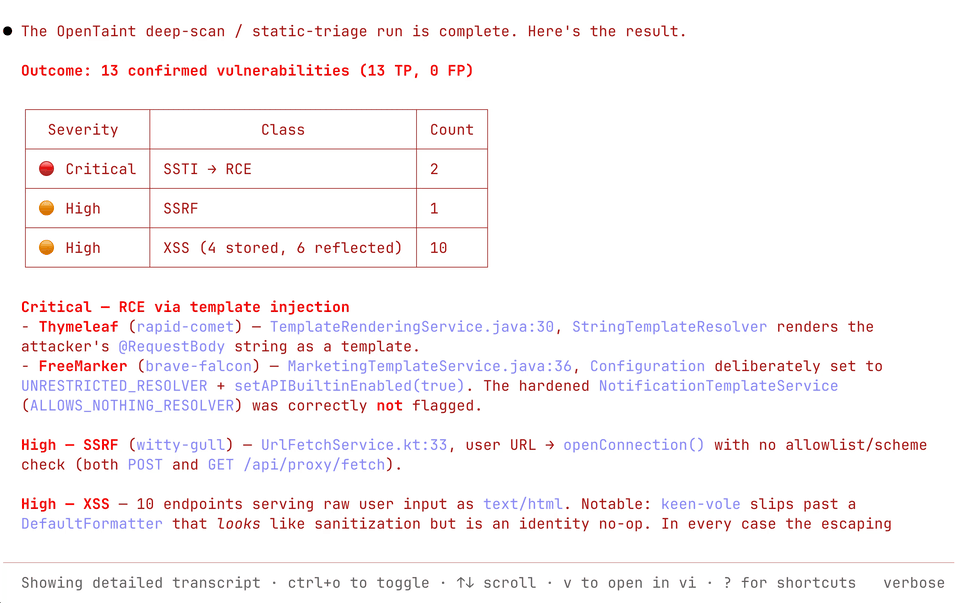

<p align="center">
  <picture>
    <source media="(prefers-color-scheme: dark)" srcset="logos/opentaint-logo-dark.svg">
    <source media="(prefers-color-scheme: light)" srcset="logos/opentaint-logo-light.svg">
    
  </picture>
</p>

<h3 align="center">The open source taint analysis engine for the AI era</h3>

<p align="center">
  <b>Formal program analysis for security agents.</b>
</p>

<p align="center">
  AI agents learn your application on demand. OpenTaint scans it on every change.
</p>

<p align="center">
  <a href="https://github.com/seqra/opentaint/releases"></a>
  <a href="LICENSE.md"></a>
  <a href="https://golang.org/"></a>
  <a href="https://discord.gg/6BXDfbP4p9"></a>
</p>

<p align="center">
  <a href="README.md">English</a> | <a href="docs/translations/README.zh.md">简体中文</a> | <a href="docs/translations/README.zht.md">繁體中文</a> | <a href="docs/translations/README.ko.md">한국어</a> | <a href="docs/translations/README.de.md">Deutsch</a> | <a href="docs/translations/README.es.md">Español</a> | <a href="docs/translations/README.fr.md">Français</a> | <a href="docs/translations/README.it.md">Italiano</a> | <a href="docs/translations/README.da.md">Dansk</a> | <a href="docs/translations/README.ja.md">日本語</a> | <a href="docs/translations/README.pl.md">Polski</a> | <a href="docs/translations/README.ru.md">Русский</a> | <a href="docs/translations/README.bs.md">Bosanski</a> | <a href="docs/translations/README.ar.md">العربية</a> | <a href="docs/translations/README.no.md">Norsk</a> | <a href="docs/translations/README.sv.md">Svenska</a> | <a href="docs/translations/README.br.md">Português (Brasil)</a> | <a href="docs/translations/README.th.md">ไทย</a> | <a href="docs/translations/README.tr.md">Türkçe</a> | <a href="docs/translations/README.ua.md">Українська</a> | <a href="docs/translations/README.bn.md">বাংলা</a> | <a href="docs/translations/README.hi.md">हिन्दी</a> | <a href="docs/translations/README.gr.md">Ελληνικά</a> | <a href="docs/translations/README.vi.md">Tiếng Việt</a> | <a href="docs/translations/README.id.md">Bahasa Indonesia</a>
</p>

<p align="center">
<a href="http://opentaint.org/">
<picture>
  <source media="(prefers-color-scheme: dark)" srcset="public/opentaint-demo-dark.gif">
  <source media="(prefers-color-scheme: light)" srcset="public/opentaint-demo-light.gif">
  
</picture>
</a>
</p>

<p align="center"><b>Supported technologies and integrations</b></p>
<p align="center">
  &nbsp;&nbsp;&nbsp;&nbsp;
  &nbsp;&nbsp;&nbsp;&nbsp;
  &nbsp;&nbsp;&nbsp;&nbsp;
  <picture>
    <source media="(prefers-color-scheme: dark)" srcset="logos/github-logo-dark.svg">
    <source media="(prefers-color-scheme: light)" srcset="logos/github-logo-light.svg">
    
  </picture>&nbsp;&nbsp;&nbsp;&nbsp;
  
</p>

<p align="center"><i>The most thorough taint analysis engine for Spring apps</i></p>

<p align="center"><b>Roadmap</b></p>
<p align="center">
  &nbsp;&nbsp;&nbsp;&nbsp;
  &nbsp;&nbsp;&nbsp;&nbsp;
  &nbsp;&nbsp;&nbsp;&nbsp;
  &nbsp;&nbsp;&nbsp;&nbsp;
  
</p>

<div align="center">
<details>
  <summary><b>More screenshots</b></summary>
  <p align="center">
    <picture>
      <source media="(prefers-color-scheme: dark)" srcset="public/opentaint-frame-dark-1.png">
      <source media="(prefers-color-scheme: light)" srcset="public/opentaint-frame-light-1.png">
      
    </picture>
  </p>
  <p align="center">
    <picture>
      <source media="(prefers-color-scheme: dark)" srcset="public/opentaint-frame-dark-2.png">
      <source media="(prefers-color-scheme: light)" srcset="public/opentaint-frame-light-2.png">
      
    </picture>
  </p>
  <p align="center">
    <picture>
      <source media="(prefers-color-scheme: dark)" srcset="public/opentaint-frame-dark-3.png">
      <source media="(prefers-color-scheme: light)" srcset="public/opentaint-frame-light-3.png">
      
    </picture>
  </p>
  <p align="center">
    <picture>
      <source media="(prefers-color-scheme: dark)" srcset="public/opentaint-frame-dark-4.png">
      <source media="(prefers-color-scheme: light)" srcset="public/opentaint-frame-light-4.png">
      
    </picture>
  </p>
  <p align="center">
    <picture>
      <source media="(prefers-color-scheme: dark)" srcset="public/opentaint-frame-dark-5.png">
      <source media="(prefers-color-scheme: light)" srcset="public/opentaint-frame-light-5.png">
      
    </picture>
  </p>
</details>
</div>

---

## Why OpenTaint?

> The open source taint analysis engine for the AI era. Powered by formal inter-procedural dataflow analysis. Customizable and self-hosted, built so AI agents drive your application security analysis without burning tokens on every scan. AI-ready open source alternative to *Semgrep Pro* and *CodeQL*.

OpenTaint is an open source taint analysis engine designed to work with AI agents. During a security review, the agent records vulnerability patterns as AST-pattern taint rules and the behavior of opaque code as dataflow summaries. On every scan, the engine applies those rules and consults those summaries while formal inter-procedural dataflow analysis tracks tainted values across the codebase. This creates a repeatable loop:

- **Learn on demand. Search on every scan.** The agent learns the attack surface, trust boundaries, vulnerability patterns, and opaque code behavior when new context is needed. The engine applies the resulting taint rules and consults the resulting dataflow summaries on every scan without spending model tokens again.
- **Make every security review executable.** The agent turns vulnerability patterns into AST-pattern taint rules and opaque code behavior into dataflow summaries. Both become versioned, reviewable analysis artifacts.
- **Fast scans. Fewer false alarms. Fewer missed findings.** The engine runs formal inter-procedural dataflow analysis, applying taint rules and consulting dataflow summaries as it tracks tainted values across procedures, fields, aliases, async code, and persistence layers at scale.
- **Open source, batteries included.** Engine, AST-pattern rules, agent skills, and CI integrations ship as one stack under Apache 2.0 and MIT.

## Quick Start

**Install script (Linux/macOS)**
```
curl -fsSL https://opentaint.org/install.sh | bash
```

**Install via Homebrew (Linux/macOS):**
```bash
brew install --cask seqra/tap/opentaint
```

**Install script (Windows PowerShell)**
```
irm https://opentaint.org/install.ps1 | iex
```

**Install via npm (Linux/macOS/Windows):**
```bash
npm install -g @seqra/opentaint
```

**Or run instantly with npx — no install required (needs Node.js):**
```bash
npx @seqra/opentaint scan
```

**Scan your project:**
```bash
opentaint scan
```

**Or use Docker:**
```bash
docker run --rm -v $(pwd):/project -v $(pwd):/output \
  ghcr.io/seqra/opentaint:latest \
  opentaint scan --output /output/results.sarif /project
```

For more options, see [Installation](docs/README.md#installation) and [Usage](docs/README.md#usage).

## Application security is the new tech debt

AI makes code cheaper to produce and harder to fully review. Security work moves downstream into review queues, remediation backlogs, and incident response, while attackers automate discovery too. Application security becomes tech debt an attacker can force you to repay. You start paying for that debt long before an incident.

- **Did the agent write a vulnerability into code you never reviewed?** The output can look finished and pass its tests while an untrusted value crosses helpers, fields, or libraries you never read before reaching a dangerous operation. OpenTaint reports the complete source-to-sink taint trace before the change becomes invisible security debt. **Generate fast. Verify before merge.**
- **Is the feature done if a vulnerability ships with it?** A feature that passes its tests can still carry security debt into production, where the fix competes with roadmap work and incident response. OpenTaint finds forbidden source-to-sink flows in the pull request and reports the taint trace before that debt becomes an emergency. **Make secure part of done.**
- **Will your security agent find tomorrow what it found today?** An agent can discover a vulnerability pattern once, then miss it on the next nondeterministic review. OpenTaint records that pattern as a versioned AST-pattern taint rule that the engine applies on every scan. **Turn every discovery into deterministic coverage.**
- **How many times will you pay an agent to review the same risk?** Your last security review already paid to understand the application’s trust boundaries, vulnerability patterns, and opaque code behavior. Every scan that starts from zero spends tokens rebuilding security context you already owned. OpenTaint records that context as taint rules and dataflow summaries, then applies the rules and consults the summaries on every change. **Spend tokens only when new context must be learned. Keep every scan fast enough to enforce.**

OpenTaint breaks that cycle by separating adaptive learning from deterministic analysis. The agent investigates new security context when needed. The engine applies the resulting taint rules, consults the dataflow summaries, and runs taint analysis on every scan. Each review becomes coverage for every future commit.

### Proof, not promises

- **[Detection depth, compared](https://opentaint.org/blog/semgrep-vs-codeql-vs-opentaint).** See Semgrep, CodeQL, and OpenTaint run against five progressively harder Java XSS cases, from direct returns to builders with virtual dispatch.
- **[A real unauthenticated RCE, from endpoint to exploit](https://opentaint.org/blog/conductor-rce-cve-2026-58138).** Follow CVE-2026-58138 through Conductor and GraalVM, see why four stock scans missed it, and how the agent turned the review into a tested taint rule and reusable dataflow summary.

---

## AI Agent Workflows

OpenTaint includes agent skills that turn static analysis into an end-to-end application-security workflow. Install them with:

```bash
npx skills add https://github.com/seqra/opentaint
```

The `appsec-agent` skill orchestrates a full project assessment: build the project, run OpenTaint, discover the attack surface, add targeted taint rules, create summaries for opaque library code, triage findings, and optionally generate dynamic proof-of-concept checks for confirmed vulnerabilities.

Included skills cover the common security-analysis loop:

- **Scan and triage:** `build-project`, `run-scan`, `analyze-findings`, `generate-poc`
- **Coverage expansion:** `triage-dependencies`, `discover-attack-surface`, `create-test-project`, `create-rule`, `assemble-lib-rules`
- **Dataflow summaries:** `analyze-external-methods`, `create-pass-through-approximation`, `create-dataflow-approximation`, `debug-rule`, `report-analyzer-issue`

---

## Documentation

Full guides — installation, usage, configuration, CI/CD integration: **[Documentation](docs/README.md)**.

## Support

- **Issues:** [GitHub Issues](https://github.com/seqra/opentaint/issues)
- **Community:** [Discord](https://discord.gg/6BXDfbP4p9)
- **Email:** [seqradev@gmail.com](mailto:seqradev@gmail.com)

## Star History

<a href="https://github.com/seqra/opentaint/stargazers">
 <picture>
   <source media="(prefers-color-scheme: dark)" srcset="https://github.com/seqra/opentaint/releases/download/star-history/latest/star-history-dark.png" />
   <source media="(prefers-color-scheme: light)" srcset="https://github.com/seqra/opentaint/releases/download/star-history/latest/star-history-light.png" />
   
 </picture>
</a>

## License

The [core analysis engine](core/) is released under the [Apache 2.0 License](LICENSE.md). The [CLI](cli/), [GitHub Action](github/), [GitLab CI template](gitlab/), and [rules](rules/) are released under the [MIT License](cli/LICENSE).
