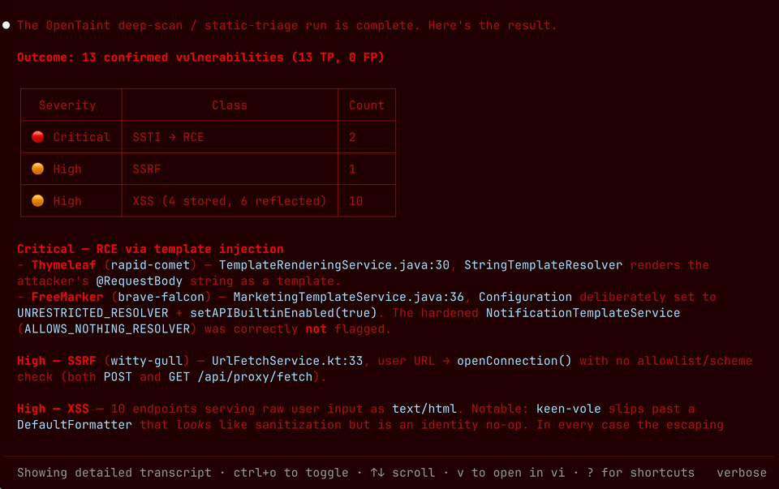

<p align="center">
  <picture>
    <source media="(prefers-color-scheme: dark)" srcset="../../logos/opentaint-logo-dark.svg">
    <source media="(prefers-color-scheme: light)" srcset="../../logos/opentaint-logo-light.svg">
    
  </picture>
</p>

<h3 align="center">Open source taint-analysmotorn för AI-eran</h3>

<p align="center">
  Formell taint-analys för applikationssäkerhet — hittar det AST-mönstermatchare missar, låter LLM-agenter omsätta sårbarheter till regler och skalar där ingen av dem klarar det ensam.
</p>

<p align="center">
  <a href="https://github.com/seqra/opentaint/releases"></a>
  <a href="https://goreportcard.com/report/github.com/seqra/opentaint/cli"></a>
  <a href="../../LICENSE.md"></a>
  <a href="https://golang.org/"></a>
  <a href="https://discord.gg/6BXDfbP4p9"></a>
</p>

<p align="center">
  <a href="../../README.md">English</a> | <a href="README.zh.md">简体中文</a> | <a href="README.zht.md">繁體中文</a> | <a href="README.ko.md">한국어</a> | <a href="README.de.md">Deutsch</a> | <a href="README.es.md">Español</a> | <a href="README.fr.md">Français</a> | <a href="README.it.md">Italiano</a> | <a href="README.da.md">Dansk</a> | <a href="README.ja.md">日本語</a> | <a href="README.pl.md">Polski</a> | <a href="README.ru.md">Русский</a> | <a href="README.bs.md">Bosanski</a> | <a href="README.ar.md">العربية</a> | <a href="README.no.md">Norsk</a> | <a href="README.sv.md">Svenska</a> | <a href="README.br.md">Português (Brasil)</a> | <a href="README.th.md">ไทย</a> | <a href="README.tr.md">Türkçe</a> | <a href="README.ua.md">Українська</a> | <a href="README.bn.md">বাংলা</a> | <a href="README.hi.md">हिन्दी</a> | <a href="README.gr.md">Ελληνικά</a> | <a href="README.vi.md">Tiếng Việt</a> | <a href="README.id.md">Bahasa Indonesia</a>
</p>

<p align="center">
<a href="http://opentaint.org/">
<a href="http://opentaint.org/">
<picture>
  <source media="(prefers-color-scheme: dark)" srcset="../../public/opentaint-demo-light.gif">
  <source media="(prefers-color-scheme: light)" srcset="../../public/opentaint-demo-dark.gif">
  
</picture>
</a>
</a>
</p>

<p align="center"><b>Stödda teknologier och integrationer</b></p>
<p align="center">
  &nbsp;&nbsp;&nbsp;&nbsp;
  &nbsp;&nbsp;&nbsp;&nbsp;
  &nbsp;&nbsp;&nbsp;&nbsp;
  <picture>
    <source media="(prefers-color-scheme: dark)" srcset="../../logos/github-logo-dark.svg">
    <source media="(prefers-color-scheme: light)" srcset="../../logos/github-logo-light.svg">
    
  </picture>&nbsp;&nbsp;&nbsp;&nbsp;
  
</p>

<p align="center"><i>Den mest grundliga taint-analysmotorn för Spring-appar</i></p>

<p align="center"><b>Färdplan</b></p>
<p align="center">
  &nbsp;&nbsp;&nbsp;&nbsp;
  &nbsp;&nbsp;&nbsp;&nbsp;
  &nbsp;&nbsp;&nbsp;&nbsp;
  &nbsp;&nbsp;&nbsp;&nbsp;
  
</p>

<div align="center">
<details>
  <summary><b>Fler skärmdumpar</b></summary>
  <p align="center">
    <picture>
      <source media="(prefers-color-scheme: dark)" srcset="../../public/opentaint-frame-light-1.png">
      <source media="(prefers-color-scheme: light)" srcset="../../public/opentaint-frame-dark-1.png">
      
    </picture>
  </p>
  <p align="center">
    <picture>
      <source media="(prefers-color-scheme: dark)" srcset="../../public/opentaint-frame-light-2.png">
      <source media="(prefers-color-scheme: light)" srcset="../../public/opentaint-frame-dark-2.png">
      
    </picture>
  </p>
  <p align="center">
    <picture>
      <source media="(prefers-color-scheme: dark)" srcset="../../public/opentaint-frame-light-3.png">
      <source media="(prefers-color-scheme: light)" srcset="../../public/opentaint-frame-dark-3.png">
      
    </picture>
  </p>
  <p align="center">
    <picture>
      <source media="(prefers-color-scheme: dark)" srcset="../../public/opentaint-frame-light-4.png">
      <source media="(prefers-color-scheme: light)" srcset="../../public/opentaint-frame-dark-4.png">
      
    </picture>
  </p>
  <p align="center">
    <picture>
      <source media="(prefers-color-scheme: dark)" srcset="../../public/opentaint-frame-light-5.png">
      <source media="(prefers-color-scheme: light)" srcset="../../public/opentaint-frame-dark-5.png">
      
    </picture>
  </p>
</details>
</div>

---

## Varför OpenTaint?

> OpenTaint är ett open source-alternativ till *Semgrep Pro* och *CodeQL* — en formell interprocedurell taint-motor som du kan anpassa och hosta själv, byggd så att AI-agenter driver din säkerhetsanalys utan att förbruka tokens vid varje skanning.

AI genererar produktionskod snabbare än säkerhetsteam hinner med, och de två typer av verktyg som byggts för att fånga dess misstag tvingar var och en till en dålig kompromiss:

- **AST-mönstermatchare** (Semgrep OSS, ast-grep, linters) är gratis och snabba, men de matchar syntax, inte dataflöde — opålitlig indata som korsar en funktionsgräns eller ett persistenslager glider rakt igenom. Den djupare, interprocedurella analys som *faktiskt* fångar det har länge varit låst i proprietära verktyg.
- **LLM-säkerhetsagenter** hittar det mönstermatchare missar, men de läser om din kod vid varje körning. Tokens hopar sig med varje fil, varje commit, varje CI-bygge — och en probabilistisk modell kan fortfarande inte lova att den fångade allt.

OpenTaint ger dig djupet hos en LLM-agent till priset av en statisk analysator:

- **Hitta det AST-mönstermatchare missar.** En formell interprocedurell dataflödesmotor spårar opålitlig data över funktionsgränser, persistenslager, alias och asynkron kod.
- **Betala modellen en gång, inte vid varje skanning.** Låt en agent destillera ett enda fynd till en taint-regel. Den deterministiska motorn spelar sedan upp den regeln över hela kodbasen — och varje commit därefter — på några minuters CPU-tid, till noll token-kostnad.
- **Open source, allt ingår.** Motor, regler och CI-integrationer levereras som en stack under Apache 2.0 och MIT.

## Snabbstart

**Installationsskript (Linux/macOS)**
```
curl -fsSL https://opentaint.org/install.sh | bash
```

**Installera via Homebrew (Linux/macOS):**
```bash
brew install --cask seqra/tap/opentaint
```

**Installationsskript (Windows PowerShell)**
```
irm https://opentaint.org/install.ps1 | iex
```

**Installera via npm (Linux/macOS/Windows):**
```bash
npm install -g @seqra/opentaint
```

**Eller kör direkt med npx — ingen installation krävs (kräver Node.js):**
```bash
npx @seqra/opentaint scan
```

**Skanna ditt projekt:**
```bash
opentaint scan
```

**Eller använd Docker:**
```bash
docker run --rm -v $(pwd):/project -v $(pwd):/output \
  ghcr.io/seqra/opentaint:latest \
  opentaint scan --output /output/results.sarif /project
```

För fler alternativ, se [Installation](../../docs/README.md#installation) och [Användning](../../docs/README.md#usage).

---

## AI-agentarbetsflöden

OpenTaint inkluderar agentfärdigheter som förvandlar statisk analys till ett komplett applikationssäkerhetsarbetsflöde. Installera dem med:

```bash
npx skills add https://github.com/seqra/opentaint
```

Färdigheten `appsec-agent` orkestrerar en fullständig projektbedömning: bygg projektet, kör OpenTaint, kartlägg attackytan, lägg till riktade regler, modellera saknade biblioteksdataflöden, triagera fynd och generera valfritt dynamiska proof-of-concept-kontroller för bekräftade sårbarheter.

Inkluderade färdigheter täcker den vanliga säkerhetsanalysloopen:

- **Skanning och triage:** `build-project`, `run-scan`, `analyze-findings`, `generate-poc`
- **Utökad täckning:** `triage-dependencies`, `discover-attack-surface`, `create-test-project`, `create-rule`, `assemble-lib-rules`
- **Dataflödesmodellering:** `analyze-external-methods`, `create-pass-through-approximation`, `create-dataflow-approximation`, `debug-rule`, `report-analyzer-issue`

---

## Dokumentation

Fullständiga guider — installation, användning, konfiguration, CI/CD-integration: **[Dokumentation](../../docs/README.md)**.

## Support

- **Problem:** [GitHub Issues](https://github.com/seqra/opentaint/issues)
- **Community:** [Discord](https://discord.gg/6BXDfbP4p9)
- **E-post:** [seqradev@gmail.com](mailto:seqradev@gmail.com)

## Stjärnhistorik

<a href="https://www.star-history.com/?repos=seqra%2Fopentaint&type=date&legend=top-left">
  <picture>
    <source media="(prefers-color-scheme: dark)" srcset="https://api.star-history.com/chart?repos=seqra/opentaint&type=date&theme=dark&legend=top-left&sealed_token=cNibcudvsLJKQVlqN0qt2kK3b3-5zBDkzDzTamAWPRP6ny8KmCeZIooBYT7NBhjkd-T6OiiW7Iu9b1FSgL6n9IHMTPuoqKahF1NtidSTKkDXcbw8bY6k57DDstncYkKHJieEn9sJQ8oKJIYyBtYuQfk19qu5Kb1kvzCMT_dqOXXv3LM7EKZlljFcXAUh" />
    <source media="(prefers-color-scheme: light)" srcset="https://api.star-history.com/chart?repos=seqra/opentaint&type=date&legend=top-left&sealed_token=cNibcudvsLJKQVlqN0qt2kK3b3-5zBDkzDzTamAWPRP6ny8KmCeZIooBYT7NBhjkd-T6OiiW7Iu9b1FSgL6n9IHMTPuoqKahF1NtidSTKkDXcbw8bY6k57DDstncYkKHJieEn9sJQ8oKJIYyBtYuQfk19qu5Kb1kvzCMT_dqOXXv3LM7EKZlljFcXAUh" />
    
  </picture>
</a>

## Licens

[Analysmotorn i kärnan](../../core/) släpps under [Apache 2.0-licensen](../../LICENSE.md). [CLI](../../cli/), [GitHub Action](../../github/), [GitLab CI-mall](../../gitlab/) och [regler](../../rules/) släpps under [MIT-licensen](../../cli/LICENSE).
